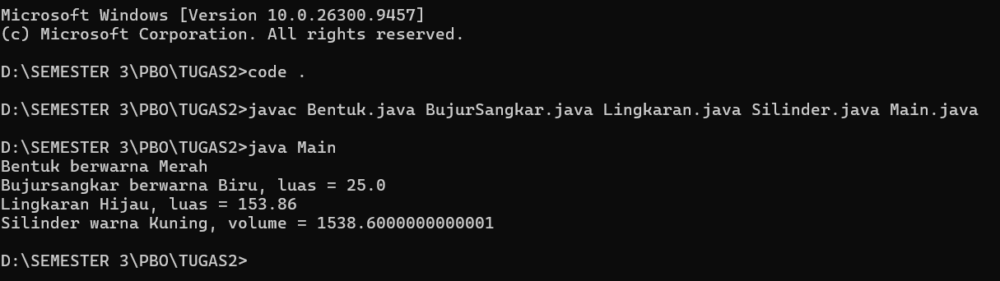

# Tugas PBO - Inheritance dan Polymorphism

## Identitas

| | |
|---|---|
| **Nama** | I Putu Reynanda Putra Dynatha |
| **NIM** | F1D02510115 |
| **Kelas** | 3B |

---

## Hasil Program



---

## Struktur File

| File | Keterangan |
|---|---|
| `Bentuk.java` | Kelas induk (superclass) |
| `BujurSangkar.java` | Turunan dari `Bentuk` |
| `Lingkaran.java` | Turunan dari `Bentuk` |
| `Silinder.java` | Turunan dari `Lingkaran` |
| `Main.java` | Program utama untuk menjalankan dan menguji kelas |

Cara menjalankan:

```
javac *.java
java Main
```

---

## Implementasi Inheritance (Pewarisan)

Pewarisan dilakukan dengan kata kunci `extends`. Hierarki kelasnya:

```
Bentuk
 ├── BujurSangkar
 └── Lingkaran
      └── Silinder
```

| Kelas Anak | Kelas Induk | Yang diwarisi |
|---|---|---|
| `BujurSangkar` | `Bentuk` | `getWarna()`, `setWarna()` |
| `Lingkaran` | `Bentuk` | `getWarna()`, `setWarna()` |
| `Silinder` | `Lingkaran` | `getRadius()`, `setRadius()`, `hitungLuas()`, serta `getWarna()` dan `setWarna()` dari `Bentuk` |

### 1. Penggunaan `extends`

```java
public class BujurSangkar extends Bentuk { ... }
public class Lingkaran extends Bentuk { ... }
public class Silinder extends Lingkaran { ... }
```

### 2. Penggunaan `super()` pada konstruktor

Konstruktor tidak diwariskan, sehingga kelas anak memanggil konstruktor induknya dengan `super(...)` pada baris pertama.

```java
public Lingkaran(double radius, String warna) {
    super(warna);          // memanggil konstruktor Bentuk
    this.radius = radius;
}

public Silinder(double tinggi, double radius, String warna) {
    super(radius, warna);  // memanggil konstruktor Lingkaran
    this.tinggi = tinggi;
}
```

### 3. Reusability (penggunaan ulang kode)

`Silinder` tidak menulis ulang rumus luas lingkaran. Ia memakai `hitungLuas()` milik `Lingkaran` untuk menghitung volume.

```java
public double hitungVolume() {
    return hitungLuas() * tinggi;   // luas alas x tinggi
}
```

### 4. Enkapsulasi

Atribut dibuat `private` dan diakses melalui getter dan setter, sehingga data tidak diubah langsung dari luar kelas.

```java
private String warna;
public String getWarna() { return warna; }
public void setWarna(String warna) { this.warna = warna; }
```

---

## Implementasi Polymorphism

### 1. Overriding method `printInfo()`

Method `printInfo()` ditulis ulang di setiap kelas turunan dengan nama dan parameter yang sama, tetapi isi berbeda (ditandai `@Override`).

| Kelas | Output `printInfo()` |
|---|---|
| `Bentuk` | Bentuk berwarna [warna] |
| `BujurSangkar` | Bujursangkar berwarna [warna], luas = [luas] |
| `Lingkaran` | Lingkaran [warna], luas = [luas] |
| `Silinder` | Silinder warna [warna], volume = [volume] |

Contoh:

```java
@Override
public void printInfo() {
    System.out.println("Silinder warna " + getWarna() + ", volume = " + hitungVolume());
}
```

### 2. Dynamic binding pada `Main.java`

Objek anak disimpan dalam array bertipe induk (`Bentuk[]`). Saat `printInfo()` dipanggil, Java menjalankan versi method milik **objek aslinya**, bukan milik tipe variabelnya.

```java
Bentuk[] daftar = new Bentuk[4];
daftar[0] = new Bentuk("Merah");
daftar[1] = new BujurSangkar(5, "Biru");
daftar[2] = new Lingkaran(7, "Hijau");
daftar[3] = new Silinder(10, 7, "Kuning");

for (Bentuk b : daftar) {
    b.printInfo();   // satu pemanggilan, hasil berbeda tiap objek
}
```

Satu baris `b.printInfo()` menghasilkan empat output yang berbeda. Inilah polimorfisme: pesan yang sama, respons berbeda sesuai objeknya, ditentukan saat program berjalan.

---

## Contoh Output

```
Bentuk berwarna Merah
Bujursangkar berwarna Biru, luas = 25.0
Lingkaran Hijau, luas = 153.86
Silinder warna Kuning, volume = 1538.6000000000001
```

Catatan: angka `1538.6000000000001` muncul karena sifat tipe `double` pada perhitungan desimal, bukan kesalahan rumus.
